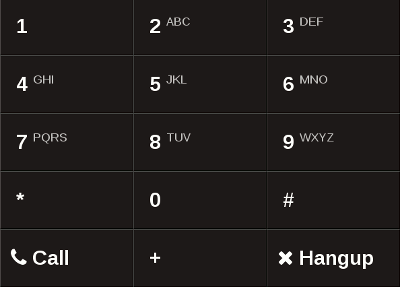

# FRH React Dial Pad

Simple React phone dial pad component inspired by the [jQuery dialpad plugin demo](http://www.jqueryscript.net/demo/Creating-A-Responsive-Phone-Dial-Pad-with-jQuery-CSS3-dialpad/).

## Demo

Try the demo [here](http://farmradiohangar.github.io/react-dial-pad/public/).

## Installation
## Usage
## Props
## Contribute

* GitHub: https://github.com/FarmRadioHangar/react-dial-pad
* Issue tracker: https://github.com/FarmRadioHangar/react-dial-pad/issues

## License

BSD
